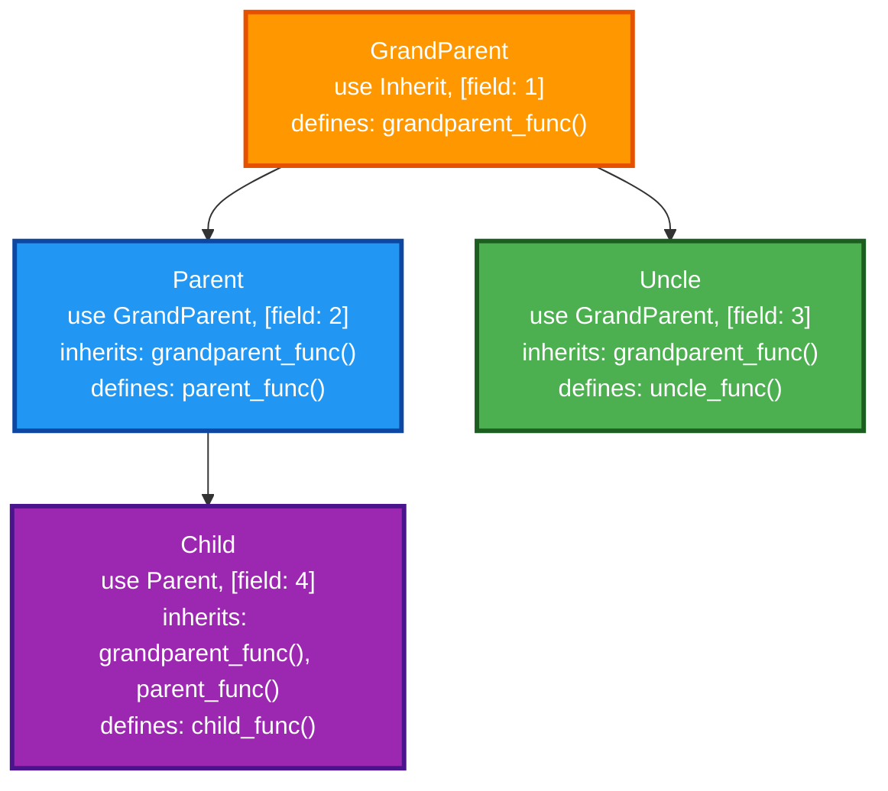

# Inherit

Inherit provides pseudo-inheritance in Elixir by allowing modules to inherit struct fields, delegate function calls, and override behaviors from parent modules.

## Features

- **Struct inheritance**: Child modules inherit all fields from parent modules
- **Function delegation**: Public functions from parent modules are automatically delegated
- **Function overriding**: Parent functions marked with `defoverridable` can be overridden by child modules
- **Custom `__using__` inheritance**: Parent modules can define custom `__using__` macros that are inherited
- **Parent module access**: Use `parent()` to access the parent module and call parent functions
- **Super calls**: Use `super()` to call the original implementation of overridden functions
- **Deep inheritance chains**: Support for multiple levels of inheritance
- **GenServer integration**: Works seamlessly with GenServer and other OTP behaviors

## Usage

### Making a module inheritable

Use `Inherit` in your module and define struct fields:

```elixir
defmodule Person do
  use Inherit, [
    name: "",
    age: 0
  ]

  def greet(person) do
    "Hello, I'm #{person.name} and I'm #{person.age} years old"
  end
  defoverridable greet: 1

  def adult?(person) do
    person.age >= 18
  end
  defoverridable adult?: 1  # Allow child modules to override this
  
  def name_length(person) do
    String.length(person.name)
  end
  # No defoverridable - child modules cannot override this
end
```

### Inheriting from a module

Use the parent module in your child module and specify additional fields:

```elixir
defmodule Employee do
  use Person, [
    salary: 0,
    department: ""
  ]

  # Override parent function with super call
  def greet(employee) do
    super(employee) <> " and I work in #{employee.department}"
  end
  defoverridable greet: 1

  # Access parent module directly
  def is_adult_person(employee) do
    parent().adult?(employee)
  end
  
  # This would compile with warning but never be called:
  def name_length(employee),
    do: 999  # Parent didn't use defoverridable!
end
```

### Using the inherited module

```elixir
# Create an Employee struct with inherited fields
employee = %Employee{
  name: "John",
  age: 30,
  salary: 50000,
  department: "Engineering"
}

# Call overridden function (with super call)
Employee.greet(employee)
# => "Hello, I'm John and I'm 30 years old and I work in Engineering"

# Call inherited function
Employee.adult?(employee)
# => true

# Call parent function via parent()
Employee.is_adult_person(employee)
# => true

# Function without defoverridable always calls parent version
Employee.name_length(employee)
# => 4 (calls Person.name_length, not any child override)
```

## Advanced Usage

### Custom `__using__` macros

Parent modules can define their own `__using__` macros that will be inherited:

```elixir
defmodule BaseServer do
  use GenServer
  use Inherit, [state: %{}]

  defmacro __using__(fields) do
    quote do
      use GenServer
      require Inherit
      Inherit.setup(unquote(__MODULE__), unquote(fields))

      def start_link(opts \\ []) do
        GenServer.start_link(__MODULE__, opts, name: __MODULE__)
      end
      defwithhold start_link: 1
      defoverridable start_link: 1
    end
  end

  @impl true
  def init(opts) do
    {:ok, struct(__MODULE__, opts)}
  end
end

defmodule MyServer do
  use BaseServer, [additional_field: "value"]
  
  # Inherits GenServer behavior and start_link function
  # Can override start_link if needed
end
```

### Deep inheritance chains

```elixir
defmodule GrandParent do
  use Inherit, [a: 1]
  def value(x), do: x
end

defmodule Parent do
  use GrandParent, [b: 2]
  def value(x), do: super(x) + 10
  defoverridable value: 1
end

defmodule Child do
  use Parent, [c: 3]
  def value(x), do: super(x) + 100
  defoverridable value: 1
end

# Child.value(5) => 115 (5 + 10 + 100)
```

### Helper Functions

- `parent()` - Returns the immediate parent module
- `parent(module)` - Returns the parent of the specified module  
- `super(args...)` - Calls the parent implementation when overriding inherited functions
- `defwithhold` - Prevents specified functions from being inherited by child modules

### Preventing Inheritance with `defwithhold`

By default, all public functions are inherited by child modules. Use `defwithhold` to prevent specific functions from being inherited:

```elixir
defmodule Parent do
  use Inherit, [field: 1]

  def inherited_function do
    "This will be inherited"
  end

  def not_inherited_function do
    "This will not be inherited"
  end
  defwithhold not_inherited_function: 0
end

defmodule Child do
  use Parent, []
  
  # Child.inherited_function() works automatically
  # Child.not_inherited_function() raises UndefinedFunctionError
end
```

## Function Overriding Rules

**Important**: Parent modules control which functions can be overridden by child modules.

- ✅ Functions marked with `defoverridable` in the parent **CAN** be overridden by children
- ❌ Functions **NOT** marked with `defoverridable` **CANNOT** be overridden (attempts compile with warnings but never execute)
- 🔄 Child modules must also use `defoverridable` when overriding to allow further inheritance

### Example

```elixir
defmodule Parent do
  use Inherit, [field: 1]
  
  def can_override, do: "parent"
  defoverridable can_override: 0
  
  def cannot_override, do: "parent only"  # No defoverridable!
end

defmodule Child do
  use Parent, []
  
  def can_override, do: "child"     # ✅ Works - parent used defoverridable
  defoverridable can_override: 0
  
  def cannot_override, do: "child"  # ⚠️ Compiles with warning, never called!
end

# Results:
Child.can_override()    # => "child"
Child.cannot_override() # => "parent only" (parent's version always used)
```

## How it works

The inheritance system creates a tree structure where modules can inherit from parent modules and define their own functions. Here's an example inheritance tree:



**Inheritance tree explanation:**

- **GrandParent**: Root module that uses `Inherit` and defines `grandparent_func()`
- **Parent**: Inherits from GrandParent, gets `grandparent_func()` automatically, defines `parent_func()`
- **Uncle**: Also inherits from GrandParent (sibling to Parent), gets `grandparent_func()`, defines `uncle_func()`
- **Child**: Inherits from Parent, gets both `grandparent_func()` and `parent_func()` automatically, defines `child_func()`

**Function availability:**
```elixir
# Child has access to all functions in the inheritance chain
Child.grandparent_func()  # Delegated from GrandParent
Child.parent_func()       # Delegated from Parent  
Child.child_func()        # Defined locally

# Uncle only has access to GrandParent functions
Uncle.grandparent_func()  # Delegated from GrandParent
Uncle.uncle_func()        # Defined locally

# Parent has access to GrandParent functions
Parent.grandparent_func() # Delegated from GrandParent
Parent.parent_func()      # Defined locally
```

**Key inheritance principles:**
- **Deep inheritance**: Child inherits transitively through the entire chain (GrandParent → Parent → Child)
- **Sibling inheritance**: Uncle and Parent both inherit from GrandParent but are independent of each other
- **Function delegation**: All ancestor functions are automatically available through delegation
- **Custom behavior**: Each module can define its own functions while inheriting from ancestors

This ensures that:
- All ancestor functions are available through delegation
- Custom `__using__` macros from ancestors are inherited
- Direct parent `__using__` is not duplicated
- The inheritance chain is properly established

## Installation

If [available in Hex](https://hex.pm/docs/publish), the package can be installed
by adding `inherit` to your list of dependencies in `mix.exs`:

```elixir
def deps do
  [
    {:inherit, "~> 0.3.0"}
  ]
end
```

## Documentation

Documentation can be generated with [ExDoc](https://github.com/elixir-lang/ex_doc)
and published on [HexDocs](https://hexdocs.pm). Once published, the docs can
be found at <https://hexdocs.pm/inherit>.

