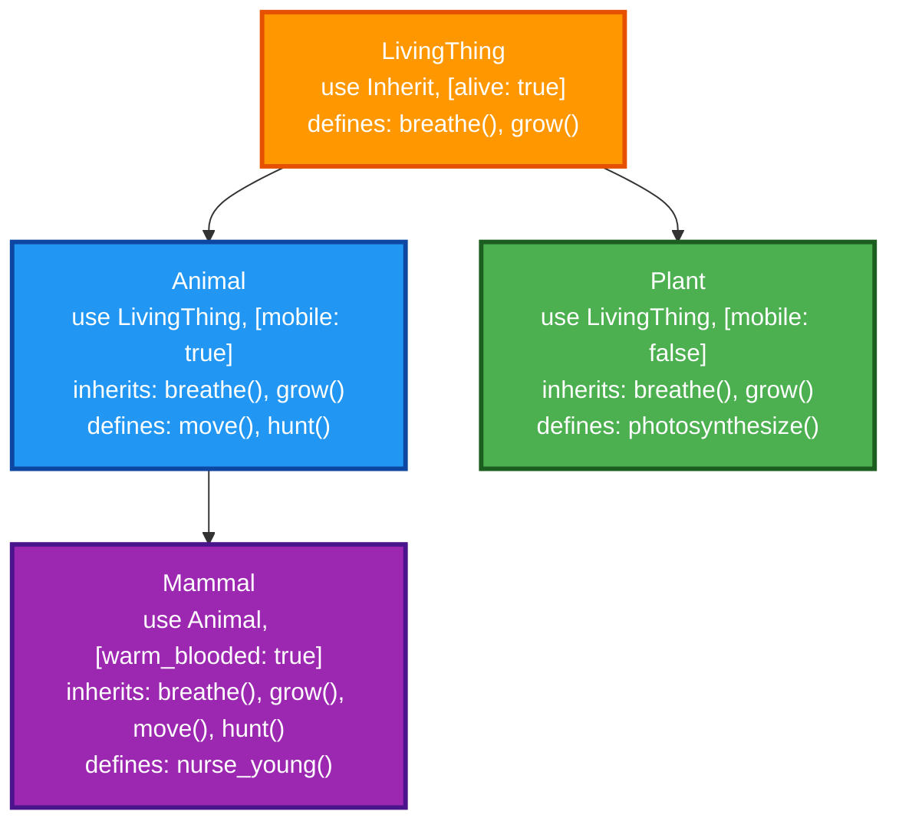

# Inherit

Inherit provides compile-time pseudo-inheritance in Elixir through sophisticated AST manipulation, enabling modules to inherit struct fields, functions, and behaviors with zero runtime overhead.

## Features

- **Compile-time AST Processing**: All inheritance resolved during compilation with `@before_compile` timing for optimal AST access
- **Smart Function Inheritance**: Dual strategy - direct AST copying for simple functions, delegation for functions calling private functions
- **Intelligent Import Resolution**: Automatically detects imported functions/macros and injects required `require` statements into child modules
- **Advanced Function Overriding**: Parent modules control overridability with `defoverridable`, supporting complex argument patterns and guards
- **`__PARENT__` Direct Access**: Compile-time macro expansion to parent module references with automatic resolution
- **`super()` Implementation Calls**: Call parent implementations in overridden functions with compile-time resolution
- **Selective Function Inheritance**: Use `defwithhold` to exclude specific functions from inheritance
- **Callback System**: Support for `before` and `after` callbacks during the inheritance process
- **Deep Inheritance Chains**: Multi-level inheritance with proper AST and import propagation through the chain
- **Custom `__using__` Inheritance**: Parent modules define custom inheritance behavior that cascades to children
- **Complex Field Support**: Handles sophisticated field types including AST-like structures and nested data

## Installation

Add `inherit` to your list of dependencies in `mix.exs`:

```elixir
def deps do
  [
    {:inherit, "~> 0.4.2"}
  ]
end
```

## Basic Usage

### Making a module inheritable

Use `Inherit` in your module and define struct fields:

```elixir
defmodule Person do
  use Inherit, [
    name: "",
    age: 0
  ]

  def greet(person) do
    "Hello, I'm #{person.name} and I'm #{person.age} years old"
  end
  defoverridable greet: 1

  def adult?(person) do
    person.age >= 18
  end
  defoverridable adult?: 1
  
  def name_length(person) do
    String.length(person.name)
  end
  # No defoverridable - child modules cannot override this
end
```

### Inheriting from a module

Use the parent module in your child module and specify additional fields:

```elixir
defmodule Employee do
  use Person, [
    salary: 0,
    department: ""
  ]

  # Override parent function with super call
  def greet(employee) do
    super(employee) <> " and I work in #{employee.department}"
  end
  defoverridable greet: 1

  # Access parent module directly using __PARENT__
  def is_adult_person(employee) do
    __PARENT__.adult?(employee)
  end
  
  # This would compile with warning but never be called:
  def name_length(employee),
    do: 999  # Parent didn't use defoverridable!
end
```

### Using the inherited module

```elixir
# Create an Employee struct with inherited fields
employee = %Employee{
  name: "John",
  age: 30,
  salary: 50000,
  department: "Engineering"
}

# Call overridden function (with super call)
Employee.greet(employee)
# => "Hello, I'm John and I'm 30 years old and I work in Engineering"

# Call inherited function
Employee.adult?(employee)
# => true

# Call parent function via __PARENT__
Employee.is_adult_person(employee)
# => true

# Function without defoverridable always calls parent version
Employee.name_length(employee)
# => 4 (calls Person.name_length, not any child override)
```

## Advanced Usage

### Custom `__using__` macros with callbacks

Parent modules can define their own `__using__` macros with callback support:

```elixir
defmodule BaseServer do
  use GenServer
  use Inherit, [state: %{}]

  defmacro __using__(fields) do
    # Before callback ensures GenServer behavior is included first
    before_callback = quote do
      use GenServer
    end

    quote do
      require Inherit
      Inherit.from(unquote(__MODULE__), unquote(fields), before: unquote(before_callback))

      def start_link(opts \\ []) do
        GenServer.start_link(__MODULE__, opts, name: __MODULE__)
      end
      defoverridable start_link: 1
    end
  end

  @impl true
  def init(opts) do
    {:ok, struct(__MODULE__, opts)}
  end
  defoverridable init: 1
end

defmodule MyServer do
  use BaseServer, [additional_field: "value"]
  
  # Inherits GenServer behavior with proper callback order
  # Can override start_link and init if needed
end
```

### Deep inheritance chains

```elixir
defmodule LivingThing do
  use Inherit, [alive: true]
  
  def life_span(thing), do: thing.alive && 100
  defoverridable life_span: 1
end

defmodule Animal do
  use LivingThing, [mobile: true]
  
  def life_span(animal), do: super(animal) + 50
  defoverridable life_span: 1
end

defmodule Mammal do
  use Animal, [warm_blooded: true]
  
  def life_span(mammal), do: super(mammal) + 25
  defoverridable life_span: 1
end

# Mammal.life_span(%Mammal{}) => 175 (100 + 50 + 25)
```

### Preventing inheritance with `defwithhold`

By default, all public functions are inherited by child modules. Use `defwithhold` to prevent specific functions from being inherited:

```elixir
defmodule Parent do
  use Inherit, [field: 1]

  def inherited_function do
    "This will be inherited"
  end

  def not_inherited_function do
    "This will not be inherited"
  end
  defwithhold not_inherited_function: 0
end

defmodule Child do
  use Parent, []
  
  # Child.inherited_function() works automatically
  # Child.not_inherited_function() raises UndefinedFunctionError
end
```

## Function Overriding Rules

**Important**: Parent modules control which functions can be overridden by child modules.

- ✅ Functions marked with `defoverridable` in the parent **CAN** be overridden by children
- ❌ Functions **NOT** marked with `defoverridable` **CANNOT** be overridden (attempts compile with warnings but never execute)
- 🔄 Child modules must also use `defoverridable` when overriding to allow further inheritance

### Example

```elixir
defmodule Parent do
  use Inherit, [field: 1]
  
  def can_override, do: "parent"
  defoverridable can_override: 0
  
  def cannot_override, do: "parent only"  # No defoverridable!
end

defmodule Child do
  use Parent, []
  
  def can_override, do: "child"     # ✅ Works - parent used defoverridable
  defoverridable can_override: 0
  
  def cannot_override, do: "child"  # ⚠️ Compiles with warning, never called!
end

# Results:
Child.can_override()    # => "child"
Child.cannot_override() # => "parent only" (parent's version always used)
```

## Key Differences from OOP Inheritance

Unlike traditional object-oriented inheritance, Inherit operates at compile-time through AST manipulation:

1. **Compile-time**: All inheritance is resolved during compilation through AST generation
2. **Explicit overriding**: Only functions marked `defoverridable` can be overridden
3. **Function delegation**: Non-overridden functions are automatically generated as delegation calls
4. **AST-based super calls**: `super()` calls are resolved at compile time to direct parent calls
5. **Module-level inheritance**: Inheritance works at the module level, not the instance level

## How It Works

The inheritance system creates a compile-time inheritance tree where modules can inherit from parent modules through AST manipulation:



**Technical Implementation:**

1. **Compile-time Processing**: All inheritance is resolved during compilation for zero runtime overhead
2. **Dual Inheritance Strategy**: 
   - **AST Copying**: Functions with no private calls have their AST copied directly to child modules
   - **Delegation**: Functions that call private functions are inherited as delegation calls to preserve encapsulation
3. **Private Function Detection**: The system analyzes parent function AST to detect calls to private functions
4. **Override Resolution**: `defoverridable` functions can be overridden, while others generate delegation calls
5. **Macro Expansion**: `__PARENT__` and `super()` calls are expanded to direct module references during compilation

## API Reference

- `__PARENT__` - Compile-time macro that expands to the immediate parent module
- `super(args...)` - Calls the parent implementation when overriding inherited functions  
- `defwithhold` - Prevents specified functions from being inherited by child modules

## Examples

### Basic inheritance with field merging:

```elixir
# Inheritance chain: Animal -> Mammal -> Primate -> Human
%Animal{species: "", habitat: ""}
%Mammal{species: "", habitat: "", warm_blooded: true, fur_type: ""}
%Primate{species: "", habitat: "", warm_blooded: true, fur_type: "", opposable_thumbs: true}
%Human{species: "Homo sapiens", habitat: "Global", warm_blooded: true, fur_type: "", opposable_thumbs: true, language: ""}
```

### Function inheritance strategies:

```elixir
# AST Copying vs Delegation based on private function usage

# Parent with private function calls
defmodule Parent do
  use Inherit, [field: 1]
  
  defp private_helper(x), do: x * 2
  
  def with_private_call(x) do
    private_helper(x) + 1    # Calls private function
  end
  defoverridable with_private_call: 1
  
  def without_private_call(x) do
    x + 10                   # No private function calls
  end
  defoverridable without_private_call: 1
end

defmodule Child do
  use Parent, [child_field: 2]
end

# Results demonstrate different inheritance strategies:
Child.with_private_call(5)    # => 11 (delegated: apply(Parent, :with_private_call, [5]))
Child.without_private_call(5) # => 15 (AST copied: x + 10)

# Real example - Animal.move/1 calls private validate_movement/1
Animal.move("walk")     # => "Moving by walk" (original implementation)
Mammal.move("run")      # => "Moving by run" (delegated to Animal due to private function call)
Primate.move("swing")   # => "Moving by swing" (delegated through inheritance chain)
Human.move("walk")      # => "Moving by walk" (delegated through inheritance chain)

# Override behavior with proper inheritance control
Animal.describe()       # => "I am an animal"
Mammal.describe()       # => "I am an animal that is warm-blooded" (overrides and calls super())
Primate.describe()      # => "I am an animal that is warm-blooded with opposable thumbs" (overrides and calls __PARENT__)

# Functions without defoverridable cannot be overridden (compilation warning)
Human.special_ability() # => "opposable thumbs" (calls Primate.special_ability, not Human - emits warning)

# Import resolution and GenServer integration with inheritance
%Human{} |> GenServer.start() # Works seamlessly with inherited GenServer behavior
```

## Documentation

Documentation can be generated with [ExDoc](https://github.com/elixir-lang/ex_doc)
and published on [HexDocs](https://hexdocs.pm). Once published, the docs can
be found at <https://hexdocs.pm/inherit>.
